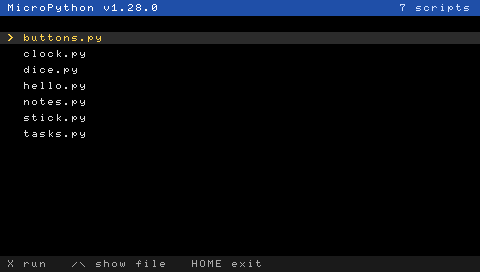

# MicroPython for the PlayStation Portable (PSP)

Write Python scripts and run them on a PSP. This is a port of
[MicroPython](https://micropython.org) 1.28 to the PSP. It runs on a PSP with
custom firmware and in the [PPSSPP](https://www.ppsspp.org) emulator.



Scripts can read the buttons, the analog stick, the battery, the clock and the
memory stick, print text, draw on the screen with Pimoroni's
[PicoVector](https://github.com/pimoroni/picovector-micropython) at 60 frames
a second, play sound, and connect to Wi-Fi. If you'd like to see more, star
the repo or open an issue: that decides how much further this goes.

## Installing

There's no release to download yet, so make the zip yourself:

1. Build the EBOOT (see [Building from source](#building-from-source)) and
   run `tools/make-release.sh`. It writes
   `build/release/micropython-psp-<version>.zip`.
2. Copy the `PSP` folder from the zip onto the memory stick, merging it with
   the `PSP` folder that's already there. You should end up with
   `PSP/GAME/MicroPython/EBOOT.PBP`.
3. On the PSP, open **Game → Memory Stick → MicroPython**.

It has been tested on a PSP-1000 running 6.60 PRO-C, and in PPSSPP 1.20.4. Other
models and custom firmwares should work too, but haven't been tried yet.

## Running scripts

Put `.py` files in `PSP/GAME/MicroPython/`, next to `EBOOT.PBP`. When
MicroPython starts, it lists them:

| Button | Action |
| --- | --- |
| Up / Down | choose a script |
| ✕ | run it |
| △ | show its source |
| ○ | back to the list |
| HOME | quit |

If the folder has a `main.py`, MicroPython runs that instead of showing the
list (after `boot.py`, if there is one). Modules in a `lib/` folder can be
imported.

The zip comes with examples: `hello`, `buttons`, `stick`, `dice`, `clock`,
`notes`, `tasks` and `colours`, plus `bounce`, `sketch` and `clockface` for
graphics, `keys` for sound and `wifi` for networking.
They're in [`examples/`](examples) too.

`demos` is a tour of PicoVector: 24 short demos from Pimoroni's Tufty 2350
(brushes, blur, gradients, strokes, fill rules, text layout, sprites and a
raycaster), redrawn for the PSP's 480×272 screen. Up and Down change demo,
and START finishes. Each demo is a small module in `demos/` with an
`update(ticks)` function, which makes them a good place to start your own.

## The `psp` module

```python
import psp

print("Press some buttons. START finishes.")
while True:
    for b in psp.pressed():
        print("pressed", b, "held:", " ".join(psp.held()))
        if b == psp.START:
            raise SystemExit
    psp.vsync()
```

| Call | Returns |
| --- | --- |
| `psp.held()` | buttons held now, for example `['CROSS', 'UP']` |
| `psp.pressed()` | buttons pressed since the last call |
| `psp.released()` | buttons released since the last call |
| `psp.UP`, `psp.CROSS`, ... | button names: `UP DOWN LEFT RIGHT CROSS CIRCLE TRIANGLE SQUARE L R START SELECT` |
| `psp.analog()` | the stick position `(x, y)`, each -127 to 127 |
| `psp.set_deadzone(n)` | ignore stick movement within `n` of the centre (default 16) |
| `psp.vsync()` | waits for the next screen refresh (60 Hz) |
| `psp.battery()` | battery percent, or `None` |
| `psp.battery_minutes()` | minutes left, or `None` |
| `psp.charging()`, `psp.on_ac()` | `True` while charging, or on mains power |
| `psp.freq()` | the clock as `(cpu, bus)` in MHz; `psp.freq(222)` sets it |
| `psp.emulator()` | `True` in PPSSPP |
| `psp.VERSION` | the port's version |

## Text: `print()` and the `ansi` module

`print()` writes to the screen: 68 columns by 34 rows of text, which wraps
at the right edge and scrolls up at the bottom. ANSI codes in the text clear
the screen, move the cursor and set colours, as in a terminal. The `ansi`
module has them ready to use:

```python
import ansi

ansi.clear()                  # clears the screen, cursor at the top left
ansi.move(10, 5)              # column 10, row 5 (both from 0)
print(ansi.RED + "Game over" + ansi.RESET)
print(ansi.BG_BLUE + ansi.BRIGHT_WHITE + " Score: 100 " + ansi.RESET)
```

| In `ansi` | Does |
| --- | --- |
| `clear()`, `clear_line()` | clears the screen, or the line from the cursor |
| `move(col, row)` | moves the cursor |
| `RED`, `GREEN`, ... | text colour: `BLACK RED GREEN YELLOW BLUE MAGENTA CYAN WHITE` |
| `BRIGHT_RED`, ... | the bright versions |
| `BG_RED`, ... | background colour |
| `BRIGHT`, `REVERSE`, `RESET` | bright text, swapped colours, back to white on black |
| `COLUMNS`, `ROWS` | the screen's size in characters: 68 and 34 |

The screen also understands the codes themselves (`"\x1b[2J"` and so on):
cursor moves up, down, left and right, saving and restoring the cursor, and
the 256-colour codes for the first 16 colours. Codes it doesn't know are
dropped. Characters past ASCII show as `?`. During a REPL session over USB,
the same codes work in the terminal on the computer. `colours.py` shows the
16 colours, and a timer redrawn in place.

## Graphics: `picovector` and `pspdisplay`

Scripts draw with Pimoroni's
[PicoVector](https://github.com/pimoroni/picovector-micropython), the
graphics library of Pimoroni's Badgeware badges, into `screen`, a 480×272
picovector image that `pspdisplay` puts on the PSP screen:

```python
import psp
from picovector import color, font, shape, vec2
from pspdisplay import screen, update, WIDTH, HEIGHT   # 480, 272

screen.font = font.load("fonts/sins.ppf")   # a font file next to the script
x = 0
while psp.START not in psp.pressed():
    screen.pen = color.rgb(0, 0, 0)
    screen.clear()
    screen.pen = color.rgb(255, 0, 0)
    screen.circle(vec2(x, HEIGHT // 2), 20)
    screen.text("Hello", vec2(8, 8))
    update()      # shows the frame at the next screen refresh
    x = (x + 4) % WIDTH
```

`picovector` has shapes (circles, polygons, stars, arcs, lines and strokes),
brushes and colours (RGB, HSV and OKLCH, with alpha), images (load PNG, JPEG
and GIF files, blit and scale them, sprite sheets and filters), transforms,
vector (`.af`) and pixel (`.ppf`) fonts, and tweens. On the PSP:

- `update()` waits for the screen refresh, so a drawing loop runs at up to
  60 frames a second without any other pacing. The drawing stays in place
  between frames.
- Antialiasing is off until you set `screen.antialias = image.X2` or `X4`.
- Fonts load from files: `font.load("fonts/sins.ppf")` with a folder in the
  name opens that file, relative to the script's folder. A name on its own
  (`font.load("sins")`, or `font.sins`) looks in folders such as
  `/rom/fonts`, which the PSP doesn't have. The examples come with
  `fonts/sins.ppf`, one of the Badgeware pixel fonts.
- Text markup works as on the Tufty: `[pen:r,g,b]` inside a string changes
  colour mid-text, and `image.add_glyph(name, fn)` adds codes of your own.
- While a script draws, `print()` doesn't reach the screen. When the script
  ends, the launcher takes the screen back with the last frame still
  showing, and the next script's `screen` starts black.
- On a PSP-1000, a fully saturated colour (such as a pure rainbow) shifting
  slowly across the whole screen flickers. That's the PSP's LCD, not the
  drawing.

## Sound: the `audio` module

```python
import audio

music = audio.play("music.mp3", loop=True)
beep = audio.play("beep.wav", volume=0.5)
music.volume = 0.3       # also pause(), resume(), stop(), and .playing
audio.volume(0.8)        # master volume
audio.stop()             # stop everything
```

- `audio.play()` takes WAV files (8 or 16-bit, mono or stereo, any sample
  rate) and MP3s, which the PSP's hardware decoder streams from the file.
- Up to 8 sounds play at once, and at most 2 of them can be MP3s. Starting
  one more stops the oldest.
- `audio.Stream(rate=22050, channels=1, bits=16)` plays samples made by the
  script: `write(buf)` queues them and waits while the queue is full,
  `space()` says how many bytes fit without waiting, `close()` ends it.
- When a script ends, the launcher stops its sounds.

## Wi-Fi: `network`, `socket` and `requests`

```python
import network, requests

wlan = network.WLAN()
wlan.profiles()            # [(1, "Home"), ...]: the networks saved in Settings
wlan.connect("Home")       # by name or number; waits until connected
print(wlan.ifconfig())     # (ip, netmask, gateway, dns)
r = requests.get("http://example.com/")
print(r.status_code, r.text[:60])
wlan.disconnect()
```

- The PSP connects with the networks saved in its own Settings > Network
  Settings, so add yours there first, and turn the Wi-Fi switch on. The
  PSP only knows WEP and WPA. For WPA2, install the
  [wpa2psp](https://github.com/Kethen/wpa2psp) plugin (ARK-4 has it built
  in); that's how it was tested on 6.60 PRO-C.
- `socket` is MicroPython's standard module: TCP and UDP, `getaddrinfo`,
  timeouts, non-blocking sockets and `select.poll`.
- `requests` (from micropython-lib) does plain `http://` only: there's no
  HTTPS yet.
- When a script ends, the launcher disconnects.

## A REPL over USB (PSPLINK)

For development, MicroPython's `>>>` prompt can run on the PSP with your
Mac's (or PC's) keyboard, over a USB cable, using
[PSPLINK](https://github.com/pspdev/psplinkusb). The PSP's working folder is
then a folder on your computer, so you can edit a module there and `import`
it straight away.

One-off setup:

1. Copy the `psplink` folder from PSPLINK's
   [release](https://github.com/pspdev/psplinkusb/releases) to
   `PSP/GAME/PSPLINK/` on the memory stick.
2. Install the [pspdev](https://github.com/pspdev/pspdev) toolchain, which has
   `usbhostfs_pc` and `pspsh`, and
   [`mpremote`](https://docs.micropython.org/en/latest/reference/mpremote.html).

Each time:

1. Connect the PSP by USB, and start PSPLINK from the Game menu (not USB
   mode).
2. In the build folder (`build/psp`), which the PSP then sees as
   `host0:/`, run `usbhostfs_pc` and leave it running.
3. In another terminal, run `tools/psp-repl.sh`. It starts MicroPython in
   REPL mode (`./micropython.prx repl` in `pspsh`: PSPLINK starts the
   build's `.prx`, not the EBOOT) and opens it in `mpremote`. Press Enter for
   a prompt; Ctrl-] leaves `mpremote`.

To use the copy from the release zip instead, with the scripts on the memory
stick, run usbhostfs_pc in any folder and
`tools/psp-repl.sh --prx ms0:/PSP/GAME/MicroPython/micropython.prx`. The zip
ships `micropython.prx` next to `EBOOT.PBP` for this; delete it if you don't
need the REPL.

The prompt has history, tab completion, paste mode (Ctrl-E) and Ctrl-C to stop
running code; Ctrl-D starts MicroPython afresh. The session shows on the
PSP's screen too. Other `mpremote` commands work through the same script
(leave out the word `mpremote`). A path starting with `:` is on the PSP;
any other path is on the computer:

```sh
tools/psp-repl.sh ls                                # the PSP's working folder
tools/psp-repl.sh run examples/hello.py             # run a file from the computer
tools/psp-repl.sh cp examples/hello.py :hello2.py   # computer to PSP
tools/psp-repl.sh cp :notes.txt /tmp/               # PSP to computer
tools/psp-repl.sh mount examples exec "import hello"
                    # the PSP imports from a folder on the computer
```

Started from the build folder, the PSP's working folder is `host0:/`; give
the memory stick's files in full (`:ms0:/PSP/GAME/MicroPython/notes.txt`), or
start the memory stick's copy with `--prx`.

## What works and what doesn't

**Works:**
- Most of MicroPython's standard library: `os`, `time`, `json`, `re`,
  `random`, `math`, `struct`, `collections`, `asyncio`, `deflate`, `hashlib`
  and more. MicroPython's own test suite passes (801 tests).
- Files on the memory stick, with `open()` and `os`. Scripts run with their
  own folder as the working directory.
- `time` reads the PSP's real-time clock and time zone.
- About 12 MB of memory for Python, sized to fit a PSP-1000.

**Doesn't work yet:**
- **The REPL needs a computer.** It runs over USB with PSPLINK (see above);
  on the PSP alone, you run scripts from the launcher.
- **No HTTPS, USB or threads.**
- **Floats are single precision** (about 7 significant digits).
- **`os.rename` can't move a file to another folder.** The PSP can only rename
  within a folder, so a move raises `OSError` (`EXDEV`, 18). Copy the file
  and delete the old one instead.

## Building from source

You need the [pspdev](https://github.com/pspdev/pspdev) toolchain, CMake,
Python 3 and a host C compiler (for `mpy-cross`).

```sh
git clone --recurse-submodules https://github.com/thirdr/micropython-psp.git
cd micropython-psp
psp-cmake -S ports/psp -B build/psp -DCMAKE_BUILD_TYPE=Release
cmake --build build/psp -j8
```

That writes `build/psp/EBOOT.PBP`. `tools/make-release.sh` packs it into the
release zip, in `build/release/`.

The port lives in [`ports/psp`](ports/psp) and builds against the
[`micropython`](micropython) submodule, which isn't modified.

## Testing

The tests run in PPSSPPHeadless, PPSSPP's command-line build, which you
build from PPSSPP's source. Set `PPSSPP_HEADLESS` to its path (the default is
`../ppsspp/build-headless/PPSSPPHeadless`). `tools/run-ppsspp.sh` runs an EBOOT, shows its
output in the terminal and saves a screenshot:

```sh
tools/run-ppsspp.sh --files tests/fs build/psp/EBOOT.PBP 30
tools/run-mp-tests.sh   # MicroPython's own test suite
```

The folders in [`tests/`](tests) are script sets that each run as a PSP
folder. CI ([`.github/workflows/build.yml`](.github/workflows/build.yml))
builds the EBOOT, runs every test headless, and makes the release zip.

## License

MIT; see [`LICENSE`](LICENSE). MicroPython itself is MIT-licensed too; see
[`micropython/LICENSE`](micropython/LICENSE).

The EBOOT also contains Pimoroni's PicoVector (from
[picovector-micropython](https://github.com/pimoroni/picovector-micropython)),
with the PNGdec and JPEGDEC decoders (Apache 2.0) and the QR Code generator
library (MIT) it bundles, `requests` (MIT,
from [micropython-lib](https://github.com/micropython/micropython-lib)) and the pspdev
toolchain's pspsdk (BSD), newlib (mostly BSD-style) and pthread-embedded
(LGPL 2.1) libraries. Their licenses are in
[`ports/psp/release/licenses`](ports/psp/release/licenses)
and ship in the release zip. The demos, their skull sprite and the examples'
fonts (`fonts/sins.ppf`, `fonts/compass.ppf`) are from Pimoroni's
[tufty2350](https://github.com/pimoroni/tufty2350) (MIT).
